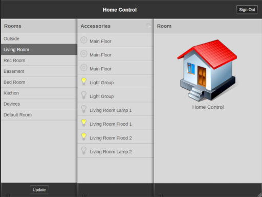

# Enyo Home Control



Currently supported back-ends:

+ Homebridge

Future support:

+ Hue (no Cloud account will be required!)
+ Home Assistant
+ Hoobs (maybe)

## What is This?

This is home automation app for the defunct mobile webOS platform, made by Palm and later acquired by HP. It runs on devices like the Palm Pre or Pixi, or the HP
Pre3 or TouchPad. 

webOS technology was acquired by LG and repurposed for TVs and IoT devices, but they made significant changes and this app will not run on those platforms.

Releases of this app, and many other new and restored apps, can be found in the [webOS Archive App Museum](http://appcatalog.webosarchive.org).

## Modern Uses

### Browser PWA

Because this Enyo application is packaged for [cross-platform use](https://github.com/codepoet80/enyo1-bootplate), you can use it on a web server as a Progressive Web App (PWA). However, if you do, you'll need to solve CORS. There's a few ways to work-around, but the easiest way I've found is to put a reverse proxy in front of the back-end, where you can control the CORS headers. When logging in to Home Control, give it the URL of the proxy, instead of the back-end. Here's my Apache2 config:

```
#Homebridge NodeJS service proxy
ProxyPass / http://192.168.1.250:80/
ProxyPassReverse / http://192.168.1.250:80/

<Location / >
    Header set Access-Control-Allow-Origin "*"
    Header set Access-Control-Allow-Methods GET,POST,PUT,DELETE,OPTIONS
</Location>
```

And my nginx equivalent:

```
#Homebridge NodeJS service proxy
location / {
        add_header Access-Control-Allow-Origin *;
        proxy_pass http://192.168.1.250:80/;
}
```

An important note here is that modern browsers will also prevent you from crossing protocol schemes. If you load the PWA over HTTPS, you must provide an HTTPS URL for the back-end. If you load the PWA over HTTP, you must provide an HTTP URL for the back-end. 

PWAs can be "installed" on most modern desktop platforms, and this works quite well on macOS, Windows 10/11 and Ubuntu. However, Chrome won't advertise an app as "Installable" unless you use HTTPS, so you're likely going to be getting certs for your reverse proxy.

### iOS Homescreen

PWAs can be pinned to your iOS homescreen, and this app contains all the metadata to look and feel like an app on your iOS device.

### Android APK

The code includes a Cordova wrapper that lets you build it for Android. Getting the build environment setup can be challenging (and building for Google Play is another set of hurdles not contemplated here), so I'll periodically post a Release on GitHub for sideloading.

## Why?

Aside from being a fan of the platform, the author thinks consumers have lost out now that the smart phone ecosystem has devolved into a duopoly.
Apple and Google take turns copying each other, and consumers line up to buy basically the same new phone every year. The era when webOS, Blackberry and 
Windows Phone were serious competitors was marked by creativity in form factor and software development, which has been lost. This app represents a (futile)
attempt to keep webOS mobile devices useful for as long as possible.

The website [http://www.webosarchive.org](http://www.webosarchive.org) recovers, archives and maintains material related to development, and hosts services
that restore functionality to webOS devices. A small but active [community](http://www.webosarchive.org/discord) of users take advantage of these services to keep their retro devices alive.

## How?

Mobile webOS was truly a web-derived platform. Based on Linux, and able to run properly compiled Linux binaries, developers could get raw resources access (including GPU) through a PDK (Plug-in Development Kit) but most apps were written in some flavor of Javascript, interacting with a WebKit-based browser. The toolkits were heavily optimized for the devices, and web-based apps usually felt pretty close to native. Services could be written using NodeJS and talk to each other through API calls structured to look like web service calls. App front-ends were usually written in either the Mojo (pre-tablet) or Enyo (tablet and newer phones) Javascript frameworks. Enyo apps can often be run with only minor modification in any WebKit based browser (eg: Safari or Chrome).

You can learn more about these frameworks at the restored [SDK](http://sdk.webosarchive.org).

webOS devices can be found cheaply on eBay, and while the phones will cease to be useful as phones when the 3G shutdown is through, both the phones and the Touchpad can be used around the home for a variety of [fun and useful things](http://www.webosarchive.org/docs/thingstotry/).

If you have a device, instructions for activating, getting online and getting apps installed can be found in the [webOS Archive Docs section](http://www.webosarchive.org/docs/activate/).
